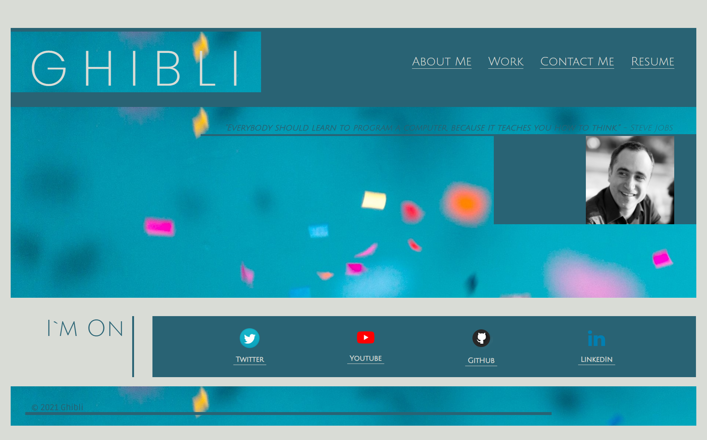

 

## **portfolio-ghibli-react** 
 

[ https://aranata.github.io/portfolio-ghibli-react/]( https://aranata.github.io/portfolio-ghibli-react/) 
 
 

## description

***

This is an assignment to create a new portfolio using our new React skills, which will help set us apart from other developers whose portfolios don’t use the latest technologies. 
The work was envisioned through wireframe diagrams as a single-page application. It was completed by using REACT coding. Best viewed at full screen, 16:10 aspect ratio. 
 

## acceptance criteria

***

The codebase achieves the following criteria: 

* GIVEN a single-page application portfolio for a web developer:
* WHEN I load the portfolio; THEN I am presented with a page containing a header, a section for content, and a footer. 
* WHEN I view the header; THEN I am presented with the developer's name and navigation with titles corresponding to different sections of the portfolio.
* WHEN I view the navigation titles; THEN I am presented with the titles About Me, Portfolio, Contact, and Resume, and the title corresponding to the current section is highlighted.
* WHEN I click on a navigation title; THEN I am presented with the corresponding section below the navigation without the page reloading and that title is highlighted.
* WHEN I load the portfolio the first time; THEN the About Me title and section are selected by default.
* WHEN I am presented with the About Me section; THEN I see a recent photo or avatar of the developer and a short bio about them.

* WHEN I am presented with the Portfolio section; THEN I see titled images of six of the developer’s applications with links to both the deployed applications and the corresponding GitHub repositories.
* WHEN I am presented with the Contact section; THEN I see a contact form with fields for a name, an email address, and a message.
* WHEN I move my cursor out of one of the form fields without entering text; THEN I receive a notification that this field is required.
* WHEN I enter text into the email address field; THEN I receive a notification if I have entered an invalid email address.
* WHEN I am presented with the Resume section; THEN I see a link to a downloadable resume and a list of the developer’s proficiencies.
* WHEN I view the footer; THEN I am presented with text or icon links to the developer’s GitHub and LinkedIn profiles, and their profile on a third platform (Stack Overflow, Twitter).
 
 

## usage

***

A full view screenshot that shows the whole webpage: 
 

 
 

## some valuable references

***

These links are listing some valuable references among others that I used doing this project:

[https://www.digitalocean.com/community/tutorials/how-to-handle-routing-in-react-apps-with-react-router](https://www.digitalocean.com/community/tutorials/how-to-handle-routing-in-react-apps-with-react-router)

[https://dev.to/mxdavis/redirecting-to-an-external-url-within-react-router-3nf1/](https://dev.to/mxdavis/redirecting-to-an-external-url-within-react-router-3nf1/)

[https://css-tricks.com/css-media-queries/](https://css-tricks.com/css-media-queries/)

[https://forum.freecodecamp.org/t/newline-in-react-string-solved/68484](https://forum.freecodecamp.org/t/newline-in-react-string-solved/68484)

[https://www.freepnglogos.com/](https://www.freepnglogos.com/)

[https://www.npmjs.com/package/react-helmet](https://www.npmjs.com/package/react-helmet)

[https://kirtikau.medium.com/react-converting-static-html-website-to-react-application-1a877a8e9948](https://kirtikau.medium.com/react-converting-static-html-website-to-react-application-1a877a8e9948)

[https://create-react-app.dev/docs/getting-started/](https://create-react-app.dev/docs/getting-started/)

[https://reactjs.org/docs/strict-mode.html](https://reactjs.org/docs/strict-mode.html)

 
 

## credits

***

Stephen Woosley - Bootcamp Instructor 
Patrick Haberern - Bootcamp TA 
Tim Nagorski - Bootcamp TA 
Sean Walmer - Bootcamp TA 
 
 

## license

***

This is an assigment done under a bootcamp program, it is public but please contact the publisher before you use or 
change any content. 
ghibli.github@gmail.com
 
 

## badges

***

 
 

---
